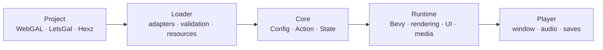
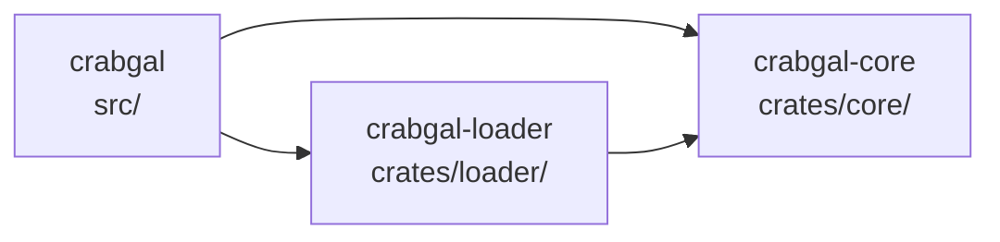

# crabgal

crabgal is a native visual novel engine built with Rust, Bevy, and wgpu. It
uses a fixed 1920×1080 design space and translates external project formats
through independent adapters.

## Highlights

- Native rendering, audio, video, UI, saves, and single-binary distribution.
- Frame-rate-independent transitions, typewriter text, timelines, and
  particles.
- Backgrounds, portraits, layers, filters, blend modes, camera transforms, and
  regional blur.
- Dialogue, narration, ruby text, choices, backlog, Auto, Skip, and rollback.
- Directory and Hexz asset overlays with development hot reload.
- WebGAL scripts and LetsGal projects compiled into one typed action model.
- Optional codec features; Ogg Opus is recommended for distributed audio.

## Run

```bash
cargo validate projects/test-project
cargo dev projects/test-project
```

Use `cargo dev-lite projects/test-project` when FFmpeg is unavailable. The
numbered visual test is in
[`projects/test-project/ACCEPTANCE.md`](projects/test-project/ACCEPTANCE.md).

| Command | Purpose |
|---|---|
| `cargo adapters` | Enable or disable built-in adapters |
| `cargo validate <project>` | Validate without opening a window |
| `cargo dev <project>` | Run with hot reload and video |
| `cargo dev-lite <project>` | Run without FFmpeg |
| `cargo preview <project>` | Run an optimized preview |
| `cargo perf <project> [seconds] [cursor] [profile]` | Record a performance sample |
| `cargo studio-sync <project>` | Follow an open LetsGal project and step |

Invalid project paths fail immediately.

## Project inputs

| Input | Entry |
|---|---|
| crabgal / WebGAL directory | `config.yaml` |
| LetsGal project | `project.json` |
| Packaged game | `game.hxz` |

A directory project can combine ordered asset sources:

```yaml
adapter:
  asset:
    - { path: ".", format: fs }
    - { path: "content/shared", format: fs }
    - { path: "packs/route.hxz", format: hexz }
  script: webgal
  store: crabgal
```

Later sources override earlier files with the same logical path. LetsGal
synchronization reads open project files and `.studio/state.json`; crabgal
remains a separate native process and does not modify Studio.

Optional shell features are disabled by default. A native `config.yaml` can
enable the Extra CG/BGM gallery explicitly:

```yaml
features:
  extra: true
```

LetsGal projects use the equivalent project-level object in `project.json`:

```json
{
  "crabgal": {
    "features": {
      "extra": true
    }
  }
}
```

Built-in adapters:

| Capability | Implementations |
|---|---|
| Assets | `auto`, `fs`, `hexz` |
| Scripts | `webgal` |
| Editor projects | `letsgal` |
| Packages | `hexz` |
| Saves | `crabgal` |

## Architecture

### Project to screen



External formats stop at the loader. The runtime only sees typed actions and
logical resources.

### Code dependencies



`core` is Bevy-free, and adapter models never enter rendering or UI code.

| Path | Responsibility |
|---|---|
| `src/` | Runtime, rendering, scenes, UI, media, and storage |
| `crates/core/` | Typed engine model and execution state |
| `crates/loader/` | Asset, script, project, and save adapters |
| `projects/test-project/` | End-to-end visual acceptance |
| `tests/` | Compiler, adapter, runtime, and coverage regressions |
| `dev/` | Documentation, packaging, and platform scripts |

## Controls

Global shortcuts use `Ctrl`; `Esc` closes or returns.

| Shortcut | Action |
|---|---|
| `Ctrl+A` / `Ctrl+K` | Auto / Skip |
| `Ctrl+B` / `Ctrl+R` | Backlog / replay voice |
| `Ctrl+H` | Hide or restore textbox |
| `Ctrl+Q` / `Ctrl+L` | Quick save / quick load |
| `Ctrl+S` / `Ctrl+O` | Save / load |
| `Ctrl+,` / `Ctrl+T` | Configuration / title |
| hold `Ctrl` | Fast-forward |
| `Esc` | Close or go back |

## Build

```bash
cargo build --release
cargo build --release --features video-ffmpeg
```

The bundled Opus decoder requires CMake. Video builds require FFmpeg
development libraries.

Package an encrypted Hexz game:

```bash
CRABGAL_HEXZ_PASSWORD='your-password' \
  dev/scripts/package-release.sh projects/test-project target/release-package
```

Create a macOS app bundle:

```bash
dev/scripts/bundle-macos.sh projects/test-project crabgal
```

## Validate

```bash
cargo fmt --all -- --check
cargo clippy --workspace --all-targets -- -D warnings
cargo test --workspace --all-targets
cargo validate projects/test-project
```

## Documentation

- [Project structure](dev/docs/PROJECT.md)
- [Content loader](dev/docs/architecture/07-content-loader.md)
- [Rendering](dev/docs/architecture/03-render-pipeline.md)
- [Saves and rollback](dev/docs/architecture/04-rollback-and-save.md)
- [LetsGal integration](dev/docs/architecture/08-letsgal-studio.md)
- [WebGAL compatibility](dev/docs/webgal-compatibility/README.md)
- [Current work](dev/docs/TODO.md)
