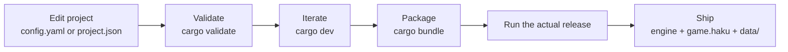
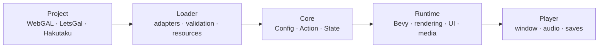
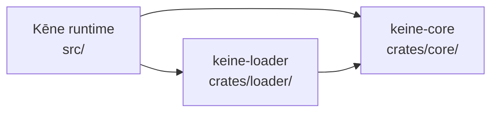
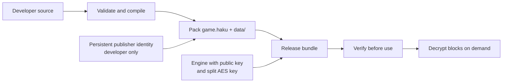

# Kēne

**English** · [中文 (Chinese)](README_CN.md)

<p align="center">
  
</p>

**Kēne** (/keːne/) is a native visual novel engine built with Rust, Bevy, and wgpu. It
uses a fixed 1920×1080 design space and translates external project formats
through independent adapters.

The product and executable are named Kēne/`keine`. Compatibility identifiers
such as the `keine` project key, save adapter, file formats, environment
variables, and internal crate names remain stable so existing games and saves
continue to work.

## Highlights

- Native rendering, audio, video, UI, saves, and self-contained distribution.
- Frame-rate-independent transitions, typewriter text, timelines, and
  particles.
- Backgrounds, portraits, layers, filters, blend modes, camera transforms, and
  regional blur.
- Dialogue, narration, ruby text, choices, backlog, Auto, Skip, and rollback.
- Directory development sources and encrypted Hakutaku releases.
- WebGAL scripts and LetsGal projects compiled into one typed action model.
- Optional codec features; Ogg Opus is recommended for distributed audio.

## Run

```bash
cargo validate projects/test-project
cargo dev projects/test-project
```

Use `cargo run -- dev projects/test-project` when FFmpeg development libraries
are unavailable (the same session without video backends). The numbered visual
test is in
[`projects/test-project/ACCEPTANCE.md`](projects/test-project/ACCEPTANCE.md).

| Command | Purpose |
|---|---|
| `cargo adapters` | Enable or disable built-in adapters |
| `cargo validate <project>` | Validate without opening a window |
| `cargo bundle <project> [--output <dir>]` | Package an encrypted release build |
| `cargo dev <project>` | Run with hot reload and video |
| `cargo perf <project> [seconds] [timeline|cursor] [profile]` | Record a performance sample |
| `cargo dev <project> --sync` | Follow an open LetsGal project and step |

Invalid project paths fail immediately.

### Source and packaged projects

Directory projects always read source scripts, preserving diagnostics and hot
reload. `cargo bundle` validates those sources and writes a versioned
`.keine/compiled/program.bin` inside the release package. Packaged `.haku` games
require that artifact and skip source-script parsing at startup. Its fixed
envelope (magic, versions, lengths, CRC32 and program fingerprint) keeps saves
compatible with the source project.

The release archive currently retains **encrypted copies** of project source
documents so every project format and resource adapter stays intact. The Hakutaku
runtime loads only `program.bin`; players do not need a separate plaintext
source directory.

## Develop a game

Kēne does not require a separate compiler project. Keep editing the original
WebGAL/native directory or LetsGal project; the same directory is used from
validation through release:



1. Create or open a project whose root contains `config.yaml` (native/WebGAL)
   or `project.json` (LetsGal).
2. Run `cargo validate <project>` after script or configuration changes. This
   checks the project without opening a window.
3. Use `cargo dev <project>` for normal iteration and hot reload. For an open
   LetsGal project, add `--sync`; Kēne reads Studio state but never modifies it.
4. Run `cargo bundle <project>`. The first bundle creates a persistent publisher
   identity at `.keine/publisher.hakutaku-key`; back it up and never ship it.
5. Validate the actual encrypted release with `run.sh`/`run.bat`, then
   distribute the complete output directory. Players do not need Rust, source
   scripts, Kēne, or LetsGal installed separately.

The default output is `target/release-package/`: `keine`/`keine.exe` is the
player, `game.haku` is the signed encrypted snapshot, `data/*.taku` contains its
immutable encrypted segments, and the remaining launcher/runtime
files belong to the same distributable. On macOS, the wrapper script places
that pair inside one `.app`.

Development always reads editable source files and stays debugger-friendly.
Only `cargo bundle` compiles the story, encrypts assets, signs the archive, and
builds the project-specific release engine.

## Project inputs

| Input | Entry |
|---|---|
| Native / WebGAL directory | `config.yaml` |
| LetsGal project | `project.json` |
| Packaged game | `game.haku` + sibling `data/` |

A directory project can combine ordered asset sources:

```yaml
adapter:
  asset:
    - { path: ".", format: fs }
    - { path: "content/shared", format: fs }
  script: webgal
  store: keine
```

Later sources override earlier files with the same logical path. LetsGal
synchronization reads open project files and `.studio/state.json`; Kēne
remains a separate native process and does not modify Studio.

Optional shell features are disabled by default. A native `config.yaml` can
enable the Extra CG/BGM gallery explicitly:

```yaml
features:
  extra: true
```

LetsGal projects use the equivalent project-level object in `project.json`:

```json
{
  "keine": {
    "features": {
      "extra": true
    }
  }
}
```

Built-in adapters:

| Capability | Implementations |
|---|---|
| Assets | `auto`, `fs` |
| Scripts | `webgal` |
| Editor projects | `letsgal` |
| Packages | `hakutaku` |
| Saves | `keine` |

## Architecture

### Project to screen



External formats stop at the loader. The runtime only sees typed actions and
logical resources.

### Code dependencies



`core` is Bevy-free, and adapter models never enter rendering or UI code.

| Path | Responsibility |
|---|---|
| `src/` | Runtime, rendering, scenes, UI, media, and storage |
| `crates/core/` | Typed engine model and execution state |
| `crates/loader/` | Asset, script, project, and save adapters |
| `projects/test-project/` | End-to-end visual acceptance |
| `tests/` | Compiler, adapter, runtime, and coverage regressions |
| `dev/` | Documentation, packaging, and platform scripts |

## Controls

Global shortcuts use `Ctrl`; `Esc` closes or returns.

| Shortcut | Action |
|---|---|
| `Ctrl+A` / `Ctrl+K` | Auto / Skip |
| `Ctrl+B` / `Ctrl+R` | Backlog / replay voice |
| `Ctrl+H` | Hide or restore textbox |
| `Ctrl+Q` / `Ctrl+L` | Quick save / quick load |
| `Ctrl+S` / `Ctrl+O` | Save / load |
| `Ctrl+,` / `Ctrl+T` | Configuration / title |
| hold `Ctrl` | Fast-forward |
| `Esc` | Close or go back |

## Build

```bash
cargo build --release
cargo build --release --features video-ffmpeg
```

The bundled Opus decoder requires CMake. Video builds require FFmpeg
development libraries.

Package an encrypted Hakutaku game:

```bash
cargo bundle path/to/native-project
```

Release packaging accepts a native project (`config.yaml`) or a LetsGal
project (`project.json`); for LetsGal, the adapter-derived config (asset
aliases, layout, styles) is materialized into `config.yaml` at build time.
The pipeline compiles `.keine/compiled/program.bin` and keeps runtime state and
caches out of the archive. Output defaults to
`target/release-package` (override with a named directory below `target/`). The
Cargo alias builds its runner in an isolated target directory, so Windows never
needs to replace the executable that is currently packaging the game.

The packaged engine is rebuilt per project: only the audio/video backends
detected in the content are compiled in, the `hardened` feature enables
anti-debugging (macOS `PT_DENY_ATTACH`, disabled core dumps, Windows debugger
exit), and the release profile (LTO + stripped symbols + `panic=abort`)
shrinks the binary from ~108 MB to ~43 MB. The persistent Hakutaku identity
owns the project ID, AES-256 root key, and Ed25519 signing key. Packaging embeds
two separately generated XOR key shares plus the public key into the matching
engine and signs the snapshot's page/block commitments. The complete key can
still be recovered from a running offline client, so this is tamper evidence
and extraction resistance rather than DRM.

Create a macOS app bundle:

```bash
dev/scripts/bundle-macos.sh projects/test-project
```

The macOS wrapper consumes the same encrypted, hardened `cargo bundle` output;
the app contains `game.haku` and `data/`, never a plaintext source directory.

### Security model

Kēne targets offline games where the player controls the machine. It protects
the distributed content from casual extraction and detects modification when
it is opened by the unmodified official engine; it does not claim DRM.



- **Confidentiality:** assets and compiled story use per-segment AES-256-GCM.
  No plaintext archive or video temporary file is created, but a determined
  owner can still recover the runtime key from the binary or process memory.
- **Integrity:** one backed-up publisher identity signs the encrypted catalog,
  page digests, and block ciphertext commitments across releases. Modified
  snapshots or segments are rejected before their plaintext is consumed.
- **Runtime hardening:** packaged engines reject simple debugger attachment and
  core dumps; development builds remain fully debuggable. These controls raise
  extraction cost but can be patched out by a determined attacker.
- **Trust boundary:** if an attacker replaces both the engine and the Hakutaku package,
  Kēne alone cannot establish publisher identity. Platform signing/notarization
  would cover that outer boundary and is intentionally outside the current
  offline package model.

The complete packaging and verification design is documented in
[Hakutaku packaging and mounts](dev/docs/architecture/06-hakutaku-packaging.md).

## Validate

```bash
cargo fmt --all -- --check
cargo clippy --workspace --all-targets -- -D warnings
cargo test --workspace --all-targets
cargo validate projects/test-project
```

## Documentation

- [Project structure](dev/docs/PROJECT.md)
- [Content loader](dev/docs/architecture/07-content-loader.md)
- [Rendering](dev/docs/architecture/03-render-pipeline.md)
- [Saves and rollback](dev/docs/architecture/04-rollback-and-save.md)
- [Hakutaku packaging and security model](dev/docs/architecture/06-hakutaku-packaging.md)
- [LetsGal integration](dev/docs/architecture/08-letsgal-studio.md)
- [WebGAL compatibility](dev/docs/webgal-compatibility/README.md)
- [Current work](dev/docs/TODO.md)
