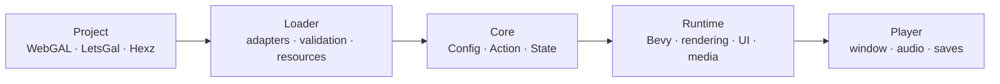
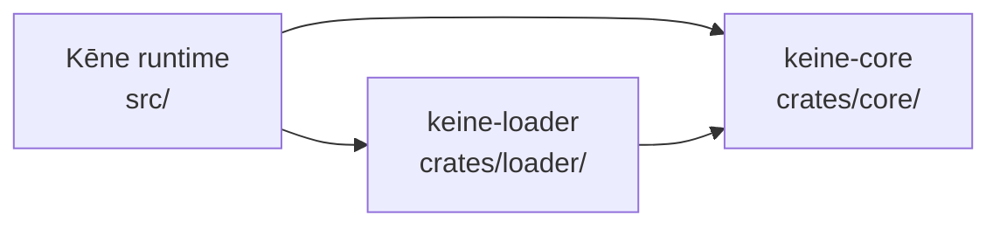

# Kēne

**English** · [中文 (Chinese)](README_CN.md)

<p align="center">
  
</p>

**Kēne** (/keːne/) is a native visual novel engine built with Rust, Bevy, and wgpu. It
uses a fixed 1920×1080 design space and translates external project formats
through independent adapters.

The product and executable are named Kēne/`keine`. Compatibility identifiers
such as the `keine` project key, save adapter, file formats, environment
variables, and internal crate names remain stable so existing games and saves
continue to work.

## Highlights

- Native rendering, audio, video, UI, saves, and single-binary distribution.
- Frame-rate-independent transitions, typewriter text, timelines, and
  particles.
- Backgrounds, portraits, layers, filters, blend modes, camera transforms, and
  regional blur.
- Dialogue, narration, ruby text, choices, backlog, Auto, Skip, and rollback.
- Directory and Hexz asset overlays with development hot reload.
- WebGAL scripts and LetsGal projects compiled into one typed action model.
- Optional codec features; Ogg Opus is recommended for distributed audio.

## Run

```bash
cargo validate projects/test-project
cargo dev projects/test-project
```

Use `cargo run -- dev projects/test-project` when FFmpeg development libraries
are unavailable (the same session without video backends). The numbered visual
test is in
[`projects/test-project/ACCEPTANCE.md`](projects/test-project/ACCEPTANCE.md).

| Command | Purpose |
|---|---|
| `cargo adapters` | Enable or disable built-in adapters |
| `cargo validate <project>` | Validate without opening a window |
| `cargo bundle <project> [--output <dir>]` | Package an encrypted release build |
| `cargo dev <project>` | Run with hot reload and video |
| `cargo preview <project>` | Run an optimized preview |
| `cargo perf <project> [seconds] [cursor] [profile]` | Record a performance sample |
| `cargo dev <project> --sync` | Follow an open LetsGal project and step |

Invalid project paths fail immediately.

### Source and packaged projects

Directory projects always read source scripts, preserving diagnostics and hot
reload. `cargo bundle` validates those sources and writes a versioned
`.keine/compiled/program.bin` inside the release package. Packaged `.hxz` games
require that artifact and skip source-script parsing at startup. Its fixed
envelope (magic, versions, lengths, CRC32 and program fingerprint) keeps saves
compatible with the source project.

## Project inputs

| Input | Entry |
|---|---|
| Native / WebGAL directory | `config.yaml` |
| LetsGal project | `project.json` |
| Packaged game | `game.hxz` |

A directory project can combine ordered asset sources:

```yaml
adapter:
  asset:
    - { path: ".", format: fs }
    - { path: "content/shared", format: fs }
    - { path: "packs/route.hxz", format: hexz }
  script: webgal
  store: keine
```

Later sources override earlier files with the same logical path. LetsGal
synchronization reads open project files and `.studio/state.json`; Kēne
remains a separate native process and does not modify Studio.

Optional shell features are disabled by default. A native `config.yaml` can
enable the Extra CG/BGM gallery explicitly:

```yaml
features:
  extra: true
```

LetsGal projects use the equivalent project-level object in `project.json`:

```json
{
  "keine": {
    "features": {
      "extra": true
    }
  }
}
```

Built-in adapters:

| Capability | Implementations |
|---|---|
| Assets | `auto`, `fs`, `hexz` |
| Scripts | `webgal` |
| Editor projects | `letsgal` |
| Packages | `hexz` |
| Saves | `keine` |

## Architecture

### Project to screen



External formats stop at the loader. The runtime only sees typed actions and
logical resources.

### Code dependencies



`core` is Bevy-free, and adapter models never enter rendering or UI code.

| Path | Responsibility |
|---|---|
| `src/` | Runtime, rendering, scenes, UI, media, and storage |
| `crates/core/` | Typed engine model and execution state |
| `crates/loader/` | Asset, script, project, and save adapters |
| `projects/test-project/` | End-to-end visual acceptance |
| `tests/` | Compiler, adapter, runtime, and coverage regressions |
| `dev/` | Documentation, packaging, and platform scripts |

## Controls

Global shortcuts use `Ctrl`; `Esc` closes or returns.

| Shortcut | Action |
|---|---|
| `Ctrl+A` / `Ctrl+K` | Auto / Skip |
| `Ctrl+B` / `Ctrl+R` | Backlog / replay voice |
| `Ctrl+H` | Hide or restore textbox |
| `Ctrl+Q` / `Ctrl+L` | Quick save / quick load |
| `Ctrl+S` / `Ctrl+O` | Save / load |
| `Ctrl+,` / `Ctrl+T` | Configuration / title |
| hold `Ctrl` | Fast-forward |
| `Esc` | Close or go back |

## Build

```bash
cargo build --release
cargo build --release --features video-ffmpeg
```

The bundled Opus decoder requires CMake. Video builds require FFmpeg
development libraries.

Package an encrypted Hexz game:

```bash
HEXZ_PASSWORD='your-password' \
  cargo bundle path/to/native-project
```

Release packaging accepts a native project (`config.yaml`) or a LetsGal
project (`project.json`); for LetsGal, the adapter-derived config (asset
aliases, layout, styles) is materialized into `config.yaml` at build time.
The pipeline compiles `.keine/compiled/program.bin` and keeps runtime state and
caches out of the archive. Output defaults to
`target/release-package` (override with a named directory below `target/`). The
Cargo alias builds its runner in an isolated target directory, so Windows never
needs to replace the executable that is currently packaging the game.

The packaged engine is rebuilt per project: only the audio/video backends
detected in the content are compiled in, the `hardened` feature enables
anti-debugging (macOS `PT_DENY_ATTACH`, disabled core dumps, Windows debugger
exit), and the release profile (LTO + stripped symbols + `panic=abort`)
shrinks the binary from ~108 MB to ~43 MB. The `HEXZ_PASSWORD` key is
XOR-masked into the binary at build time, so the plaintext never appears in
the shipped string tables. Packaging also creates a one-bundle Ed25519 keypair,
embeds only the public key in that engine, and signs the standard Hexz archive
plus its complete integrity manifest; the temporary private key is discarded
when packaging finishes. This detects resource replacement without adding a
signing-key management step. The embedded decryption password can still be
recovered from a running client, so packaged builds are tamper-evident rather
than DRM.

Create a macOS app bundle:

```bash
HEXZ_PASSWORD='your-password' \
  dev/scripts/bundle-macos.sh projects/test-project
```

The macOS wrapper consumes the same encrypted, hardened `cargo bundle` output;
the app contains `game.hxz`, never a plaintext copy of the source project.

## Validate

```bash
cargo fmt --all -- --check
cargo clippy --workspace --all-targets -- -D warnings
cargo test --workspace --all-targets
cargo validate projects/test-project
```

## Documentation

- [Project structure](dev/docs/PROJECT.md)
- [Content loader](dev/docs/architecture/07-content-loader.md)
- [Rendering](dev/docs/architecture/03-render-pipeline.md)
- [Saves and rollback](dev/docs/architecture/04-rollback-and-save.md)
- [LetsGal integration](dev/docs/architecture/08-letsgal-studio.md)
- [WebGAL compatibility](dev/docs/webgal-compatibility/README.md)
- [Current work](dev/docs/TODO.md)
