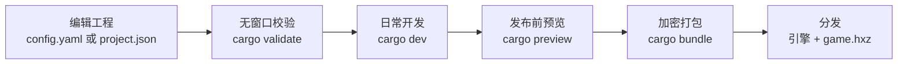
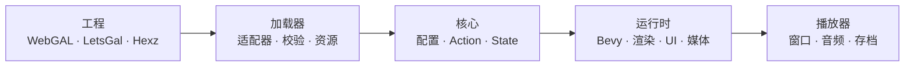
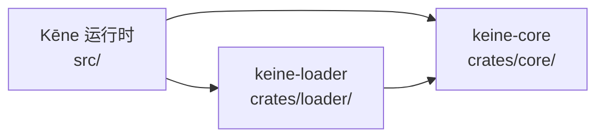
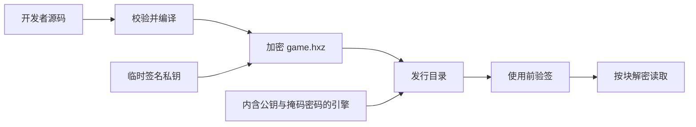

# Kēne

**简体中文** · [English](README.md)

<p align="center">
  
</p>

**Kēne**（/keːne/）是一个使用 Rust、Bevy 与 wgpu 构建的原生视觉小说引擎。它使用
固定的 1920×1080 设计空间，并通过独立适配器转换外部项目格式。

产品与可执行文件名为 Kēne/`keine`。兼容标识符——如 `keine` 项目键、存档适配器、
文件格式、环境变量与内部 crate 名称——保持稳定，以确保现有游戏与存档继续可用。

## 亮点

- 原生渲染、音频、视频、UI、存档与自包含分发。
- 与帧率无关的转场、打字机文本、时间轴与粒子。
- 背景、立绘、图层、滤镜、混合模式、相机变换与区域模糊。
- 对话、旁白、注音文本、选项、回看、自动、跳过与回滚。
- 目录与 Hexz 资源叠加，开发热重载。
- WebGAL 脚本与 LetsGal 工程统一编译为一种类型化动作模型。
- 可选编解码特性；分发音频推荐 Ogg Opus。

## 运行

```bash
cargo validate projects/test-project
cargo dev projects/test-project
```

当缺少 FFmpeg 开发库时使用 `cargo run -- dev projects/test-project`
（同一会话但不带视频后端）。编号视觉验收见
[`projects/test-project/ACCEPTANCE.md`](projects/test-project/ACCEPTANCE.md)。

| 命令 | 用途 |
|---|---|
| `cargo adapters` | 启用或禁用内置适配器 |
| `cargo validate <project>` | 不打开窗口进行校验 |
| `cargo bundle <project> [--output <dir>]` | 打包加密发布构建 |
| `cargo dev <project>` | 带热重载与视频运行 |
| `cargo preview <project>` | 运行优化预览 |
| `cargo perf <project> [seconds] [timeline|cursor] [profile]` | 记录性能样本 |
| `cargo dev <project> --sync` | 跟随打开的 LetsGal 工程逐步同步 |

无效的项目路径会立即失败。

### 源码工程与发布包

目录工程始终读取源脚本，以保留诊断和热重载。`cargo bundle` 会校验源码，并在发布包
中写入版本化的 `.keine/compiled/program.bin`；打包后的 `.hxz` 必须包含该产物，启动
时不再解析源脚本。固定 envelope（magic、版本、长度、CRC32 和程序 fingerprint）
保证发布包与源码工程的存档兼容。

## 开发一个游戏

Kēne 不要求再创建一个独立的“编译器工程”。从校验、预览到发布，始终操作原来的
WebGAL/原生目录或 LetsGal 工程：



1. 创建或打开工程：原生/WebGAL 工程根目录放 `config.yaml`，LetsGal 工程使用现有
   `project.json`。
2. 修改脚本或配置后运行 `cargo validate <工程>`；它不打开窗口，只报告确定性错误。
3. 日常使用 `cargo dev <工程>`，保留源码诊断与热重载。跟随已打开的 LetsGal 工程时
   加 `--sync`；Kēne 只读取 Studio 状态，不修改工程。
4. 发布前运行 `cargo preview <工程>`，用优化构建做最后一次视觉检查。
5. 为该游戏设置一个独立的 `HEXZ_PASSWORD`，运行 `cargo bundle <工程>`，然后分发完整
   输出目录。玩家不需要另外安装 Rust、Kēne、LetsGal，也不需要取得源脚本。

默认输出位于 `target/release-package/`：`keine`/`keine.exe` 是播放器，`game.hxz`
是加密游戏，其余启动器和运行库也属于同一个发行物。macOS 包装脚本会把这两者装入
一个 `.app`。

开发阶段始终读取可编辑源码并允许调试；只有 `cargo bundle` 才会编译剧情、加密资源、
签名归档并构建该游戏专用的发行引擎。

## 项目输入

| 输入 | 入口 |
|---|---|
| 原生 / WebGAL 目录 | `config.yaml` |
| LetsGal 工程 | `project.json` |
| 打包游戏 | `game.hxz` |

目录工程可以组合有序资源来源：

```yaml
adapter:
  asset:
    - { path: ".", format: fs }
    - { path: "content/shared", format: fs }
    - { path: "packs/route.hxz", format: hexz }
  script: webgal
  store: keine
```

后声明来源覆盖相同逻辑路径的早期文件。LetsGal 同步读取打开的工程文件与
`.studio/state.json`；Kēne 保持独立原生进程，不修改 Studio。

可选壳层特性默认关闭。原生 `config.yaml` 可以显式启用 Extra CG/BGM 图库：

```yaml
features:
  extra: true
```

LetsGal 工程使用 `project.json` 中同等的工程级对象：

```json
{
  "keine": {
    "features": {
      "extra": true
    }
  }
}
```

内置适配器：

| 能力 | 实现 |
|---|---|
| 资源 | `auto`、`fs`、`hexz` |
| 脚本 | `webgal` |
| 编辑器工程 | `letsgal` |
| 打包 | `hexz` |
| 存档 | `keine` |

## 架构

### 从工程到画面



外部格式止步于加载器。运行时只看到类型化动作与逻辑资源。

### 代码依赖



`core` 不依赖 Bevy，适配器模型也从不进入渲染或 UI 代码。

| 路径 | 职责 |
|---|---|
| `src/` | 运行时、渲染、场景、UI、媒体与存储 |
| `crates/core/` | 类型化引擎模型与执行状态 |
| `crates/loader/` | 资源、脚本、工程与存档适配器 |
| `projects/test-project/` | 端到端视觉验收 |
| `tests/` | 编译器、适配器、运行时与覆盖回归 |
| `dev/` | 文档、打包与平台脚本 |

## 快捷键

全局快捷键使用 `Ctrl`；`Esc` 关闭或返回。

| 快捷键 | 动作 |
|---|---|
| `Ctrl+A` / `Ctrl+K` | 自动 / 跳过 |
| `Ctrl+B` / `Ctrl+R` | 回看 / 重播语音 |
| `Ctrl+H` | 隐藏或恢复文本框 |
| `Ctrl+Q` / `Ctrl+L` | 快速存档 / 快速读档 |
| `Ctrl+S` / `Ctrl+O` | 存档 / 读档 |
| `Ctrl+,` / `Ctrl+T` | 设置 / 标题 |
| 按住 `Ctrl` | 快进 |
| `Esc` | 关闭或返回 |

## 构建

```bash
cargo build --release
cargo build --release --features video-ffmpeg
```

内置 Opus 解码器需要 CMake。视频构建需要 FFmpeg 开发库。

打包加密 Hexz 游戏：

```bash
HEXZ_PASSWORD='your-password' \
  cargo bundle path/to/native-project
```

发布打包接受原生工程（`config.yaml`）或 LetsGal 工程（`project.json`）；LetsGal
的适配器配置（资源别名、布局、样式）会在打包时物化为 `config.yaml`。流水线会编译
`.keine/compiled/program.bin`，并确保运行时状态与缓存不进入归档。输出默认在
`target/release-package`
（可用 `target/` 下的具名目录覆盖）。Cargo 别名会把 runner 构建到隔离的 target
目录，避免 Windows 在打包时覆盖正在运行的可执行文件。

打包引擎按项目重新构建：只编译内容中检测到的音频/视频后端，`hardened` 特性启用
反调试（macOS `PT_DENY_ATTACH`、禁用 core dump、Windows 检测到调试器即退出），
release profile（LTO + 剥离符号 + `panic=abort`）把二进制从约 108 MB 压到约
43 MB。`HEXZ_PASSWORD` 在构建期以 XOR 掩码写进二进制，明文不会出现在发行包的
字符串表中。打包还会生成仅用于本次发行包的 Ed25519 密钥对：私钥签名后随临时目录
销毁，公钥编译进配套引擎。它能检测资源替换，但不能把离线客户端变成 DRM。

创建 macOS 应用包：

```bash
HEXZ_PASSWORD='your-password' \
  dev/scripts/bundle-macos.sh projects/test-project
```

macOS 包装脚本复用同一套加密且启用加固的 `cargo bundle` 产物；App 内只携带
`game.hxz`，不会复制明文源项目。

### 安全模型

Kēne 面向玩家完全控制本机的离线游戏。它的目标是防止直接解包，并让未被修改的官方
引擎能够发现资源篡改；它不承诺 DRM。



- **保密性：**素材与编译后的剧情使用 AES-256-GCM 加密进 `game.hxz`。密码经过掩码，
  运行时不会生成完整明文归档或视频临时文件；但能控制电脑的攻击者最终仍可从二进制
  或进程内存取得密码。
- **完整性：**每次打包生成临时 Ed25519 密钥对，私钥不进入发行物，公钥只进入配套
  引擎。header、索引、metadata、字典或数据块被修改后都会被拒绝；归档仍是标准 Hexz。
- **运行时加固：**发行引擎会阻止最直接的调试器挂载和 core dump，开发构建保持完全
  可调试。这只提高提取成本，坚定的攻击者仍可修改引擎绕过检查。
- **信任边界：**如果攻击者同时替换引擎与 `game.hxz`，Kēne 自身无法证明发布者身份。
  macOS/Windows 平台签名负责最外层身份，但目前按你的决定暂缓。

完整的打包、验签和随机读取设计见
[Hexz 打包与挂载](dev/docs/architecture/06-hexz-packaging.md)。

## 校验

```bash
cargo fmt --all -- --check
cargo clippy --workspace --all-targets -- -D warnings
cargo test --workspace --all-targets
cargo validate projects/test-project
```

## 文档

- [项目结构](dev/docs/PROJECT.md)
- [内容加载器](dev/docs/architecture/07-content-loader.md)
- [渲染](dev/docs/architecture/03-render-pipeline.md)
- [存档与回滚](dev/docs/architecture/04-rollback-and-save.md)
- [Hexz 打包与安全模型](dev/docs/architecture/06-hexz-packaging.md)
- [LetsGal 集成](dev/docs/architecture/08-letsgal-studio.md)
- [WebGAL 兼容](dev/docs/webgal-compatibility/README.md)
- [当前工作](dev/docs/TODO.md)
