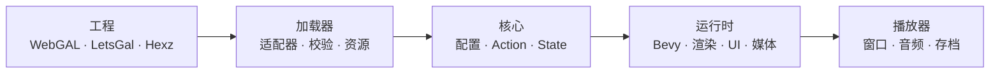
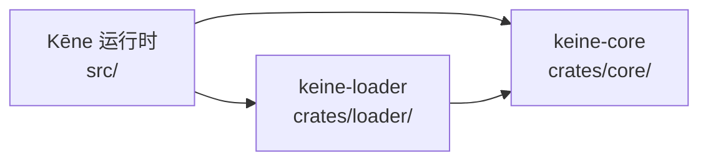

# Kēne

**简体中文** · [English](README.md)

<p align="center">
  
</p>

**Kēne**（/keːne/）是一个使用 Rust、Bevy 与 wgpu 构建的原生视觉小说引擎。它使用
固定的 1920×1080 设计空间，并通过独立适配器转换外部项目格式。

产品与可执行文件名为 Kēne/`keine`。兼容标识符——如 `keine` 项目键、存档适配器、
文件格式、环境变量与内部 crate 名称——保持稳定，以确保现有游戏与存档继续可用。

## 亮点

- 原生渲染、音频、视频、UI、存档与单二进制分发。
- 与帧率无关的转场、打字机文本、时间轴与粒子。
- 背景、立绘、图层、滤镜、混合模式、相机变换与区域模糊。
- 对话、旁白、注音文本、选项、回看、自动、跳过与回滚。
- 目录与 Hexz 资源叠加，开发热重载。
- WebGAL 脚本与 LetsGal 工程统一编译为一种类型化动作模型。
- 可选编解码特性；分发音频推荐 Ogg Opus。

## 运行

```bash
cargo validate projects/test-project
cargo dev projects/test-project
```

当缺少 FFmpeg 开发库时使用 `cargo run -- dev projects/test-project`
（同一会话但不带视频后端）。编号视觉验收见
[`projects/test-project/ACCEPTANCE.md`](projects/test-project/ACCEPTANCE.md)。

| 命令 | 用途 |
|---|---|
| `cargo adapters` | 启用或禁用内置适配器 |
| `cargo validate <project>` | 不打开窗口进行校验 |
| `cargo compiler <project> [--output <path>]` | 把源脚本编译为 `program.bin` 产物 |
| `cargo dev <project>` | 带热重载与视频运行 |
| `cargo preview <project>` | 运行优化预览 |
| `cargo perf <project> [seconds] [cursor] [profile]` | 记录性能样本 |
| `cargo dev <project> --sync` | 跟随打开的 LetsGal 工程逐步同步 |

无效的项目路径会立即失败。

### 编译程序产物

`cargo compiler <project>` 与 `cargo validate` 一样解析并校验项目，然后把版本化
二进制程序写入 `.keine/compiled/program.bin`（可用 `--output <path>` 覆盖）。
产物使用固定 envelope（magic、版本、长度、CRC32、程序 fingerprint），让发布包在
启动时跳过源脚本解析；fingerprint 与源码构建的程序一致，因此存档保持兼容。
开发运行仍然读取源脚本，以获得诊断与热重载。可用
`cargo compiler preview <project>` 对任何已生成 program.bin 的工程运行编译加载路径。
发布流水线会自动执行这一步，并在打包配置中固定 `compiled_program: require`。

## 项目输入

| 输入 | 入口 |
|---|---|
| 原生 / WebGAL 目录 | `config.yaml` |
| LetsGal 工程 | `project.json` |
| 打包游戏 | `game.hxz` |

目录工程可以组合有序资源来源：

```yaml
adapter:
  asset:
    - { path: ".", format: fs }
    - { path: "content/shared", format: fs }
    - { path: "packs/route.hxz", format: hexz }
  script: webgal
  store: keine
```

后声明来源覆盖相同逻辑路径的早期文件。LetsGal 同步读取打开的工程文件与
`.studio/state.json`；Kēne 保持独立原生进程，不修改 Studio。

可选壳层特性默认关闭。原生 `config.yaml` 可以显式启用 Extra CG/BGM 图库：

```yaml
features:
  extra: true
```

LetsGal 工程使用 `project.json` 中同等的工程级对象：

```json
{
  "keine": {
    "features": {
      "extra": true
    }
  }
}
```

内置适配器：

| 能力 | 实现 |
|---|---|
| 资源 | `auto`、`fs`、`hexz` |
| 脚本 | `webgal` |
| 编辑器工程 | `letsgal` |
| 打包 | `hexz` |
| 存档 | `keine` |

## 架构

### 从工程到画面



外部格式止步于加载器。运行时只看到类型化动作与逻辑资源。

### 代码依赖



`core` 不依赖 Bevy，适配器模型也从不进入渲染或 UI 代码。

| 路径 | 职责 |
|---|---|
| `src/` | 运行时、渲染、场景、UI、媒体与存储 |
| `crates/core/` | 类型化引擎模型与执行状态 |
| `crates/loader/` | 资源、脚本、工程与存档适配器 |
| `projects/test-project/` | 端到端视觉验收 |
| `tests/` | 编译器、适配器、运行时与覆盖回归 |
| `dev/` | 文档、打包与平台脚本 |

## 快捷键

全局快捷键使用 `Ctrl`；`Esc` 关闭或返回。

| 快捷键 | 动作 |
|---|---|
| `Ctrl+A` / `Ctrl+K` | 自动 / 跳过 |
| `Ctrl+B` / `Ctrl+R` | 回看 / 重播语音 |
| `Ctrl+H` | 隐藏或恢复文本框 |
| `Ctrl+Q` / `Ctrl+L` | 快速存档 / 快速读档 |
| `Ctrl+S` / `Ctrl+O` | 存档 / 读档 |
| `Ctrl+,` / `Ctrl+T` | 设置 / 标题 |
| 按住 `Ctrl` | 快进 |
| `Esc` | 关闭或返回 |

## 构建

```bash
cargo build --release
cargo build --release --features video-ffmpeg
```

内置 Opus 解码器需要 CMake。视频构建需要 FFmpeg 开发库。

打包加密 Hexz 游戏：

```bash
HEXZ_PASSWORD='your-password' \
  dev/scripts/package-release.sh path/to/native-project target/release-package
```

发布打包要求带 `config.yaml` 的原生工程；LetsGal（`project.json`）工程需要先完成
原生转换，见 [`docs/project-and-assets-spec.md`](docs/project-and-assets-spec.md)。
流水线会编译 `.keine/compiled/program.bin`、固定 `compiled_program: require`，并
确保运行时状态与缓存不进入归档。

创建 macOS 应用包：

```bash
dev/scripts/bundle-macos.sh projects/test-project
```

## 校验

```bash
cargo fmt --all -- --check
cargo clippy --workspace --all-targets -- -D warnings
cargo test --workspace --all-targets
cargo validate projects/test-project
```

## 文档

- [项目结构](dev/docs/PROJECT.md)
- [内容加载器](dev/docs/architecture/07-content-loader.md)
- [渲染](dev/docs/architecture/03-render-pipeline.md)
- [存档与回滚](dev/docs/architecture/04-rollback-and-save.md)
- [LetsGal 集成](dev/docs/architecture/08-letsgal-studio.md)
- [WebGAL 兼容](dev/docs/webgal-compatibility/README.md)
- [当前工作](dev/docs/TODO.md)
