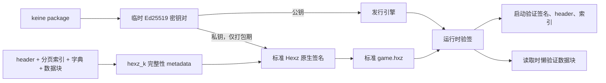

# Hexz 打包与挂载

> 状态：已集成 `maincoretech/hexz_k`。Keine 不再定义私有容器协议。

## 边界

- `hexz_k::ResourcePack` 负责标准 `.hxz` 的索引、校验、解压、解密信息和随机读取。
- 发布流水线（`keine package`）通过 hexz_k 的 `pack` 库接口负责 zstd 与
  AES-256-GCM 分块打包；运行时（游戏）不依赖 `hexz-ops`，也不复制 magic、
  header、block 或 CRC 语义。
- `keine-loader::adapter::asset::hexz` 只负责配置适配、安全路径检查和 loader mount。
- Hexz 不进入 core、ECS、UI 或脚本解析。

## 打包

打包属于发布流水线，不属于引擎或 loader API。`keine package` 通过 hexz_k 的
`pack` 库接口生成标准 `.hxz`，默认采用 64 KiB block、zstd 和 AES-256-GCM 分块加密。
文件排除由 `keine package` 的 staging 清理显式完成（`saves/`、`imported_assets/`、
`.keine`、`*.meta`、`.DS_Store`）；Hexz 标准的 `.gitignore`、`.ignore` 或
`.hexzignore` 仍可作为补充。

默认编译期资源密钥只用于防止资源被直接解压，属于弱保护而不是 DRM。发行方可在构建打包工具和
引擎时使用同一个 `HEXZ_PASSWORD`；客户端内置密钥始终可能被逆向获得。密钥在
`keine-loader` 构建时由 `build.rs` 做 XOR 混淆（`cargo:rerun-if-env-changed`
保证换密码时缓存正确失效），明文不会进入二进制字符串表；运行时才在内存还原。

`keine package` 编译引擎时会额外启用 `hardened` feature，抬高运行期提取成本：
macOS 上调用 `PT_DENY_ATTACH` 拒绝内核级调试器挂载、Unix 上禁用 core dump（防止
崩溃转储泄漏还原后的密钥）、Windows 上检测到调试器立即退出。开发构建不启用该
feature，`cargo dev` 与 CI runner 始终可调试。这一切仍不是 DRM：修改二进制或换一种
内存转储方式即可绕过。

### 标准签名与完整性配置

`keine package` 会为每个发行包临时生成一对 Ed25519 密钥：私钥只存在于本次打包的
临时目录，公钥编译进同一包的引擎，流水线结束时临时目录自动删除。因此本地与 CI 都
不需要保管平台签名证书或长期 Hexz 签名密钥；若以后需要跨版本发行身份，再单独增加
稳定私钥输入即可，不影响当前格式。

归档仍是完整的标准 Hexz 0.8：最终签名使用 Hexz 原生 header 字段与 Ed25519
`sign_archive`，额外的 `hexz_k_integrity` 只是 metadata 中的可忽略 JSON 字段。旧工具
可以打开、提取和执行原生验签；Keine 则在此基础上验证 header、分页索引、压缩字典和
所有物理数据块。分页索引在打开时验证，数据块只在第一次 cache miss 时计算 BLAKE3，
不会为了安全在启动时遍历整个游戏。

这个模型把“保密”和“发布者完整性”分开：AES 密码随离线客户端分发，主要防止直接
解包；Ed25519 私钥不进入客户端，所以提取出 AES 密码仍不能伪造通过验证的新资源包。
它不替代未来的 macOS/Windows 平台代码签名，也不能阻止攻击者修改引擎本身后移除验证。

推荐发行音频统一采用标准 Ogg Opus（`.opus`）。BGM、语音、音效与 UI 提示音共用
同一加载入口，Opus 使用增量解码路径；发布脚本同时允许引擎已启用的 WAV、MP3、
Vorbis 与 FLAC 素材直接进入 app 或 Hexz，兼容素材无需为了打包强制转码。默认
`bundled-opus` 特性静态构建 libopus，因此目标设备不需要安装动态库；构建机需要
CMake。

开发构建默认启用 `audio-all`，以便直接预览不同来源的素材。`keine package` 会在
编译前扫描项目内全部资源层，根据 `.opus`、`.wav`、`.mp3`、
`.ogg/.oga/.spx` 和 `.flac` 只启用实际需要的 Cargo features。标准发行还会启用
`ui-sounds`，因为内置 WebGAL K 提示音使用 Opus；明确禁用 UI 音效的自定义构建才可
同时移除 Symphonia 0.6、Opus adapter、libopus 与 CMake 要求。无法静态检查内容的
嵌套 Hexz 保守回退到 `audio-all`，CI 也可通过 `KEINE_AUDIO_FEATURES` 显式覆盖
检测结果。

`cargo bundle` 是无冲突的 Cargo 入口（避免与 Cargo 自带的 `package` 命令重名）。
`bundle-macos.sh` 只把这一流水线生成的 hardened 引擎与 encrypted `game.hxz` 包装进
标准 App 目录，不再单独构建引擎，也不复制明文项目。

含视频内容时，`keine package` 只启用目标平台的发行后端：macOS 为 `video-native`，
Windows/Linux 为 `video-ffmpeg`。Windows 发行同时支持 x64 与 ARM64；Linux 包递归收集
FFmpeg 的非 glibc 动态依赖到本地 `lib/`，启动脚本只为该包设置库搜索路径。

## 读取

1. 主发行包使用内嵌公钥强制完整性校验，并采用
   `ResourcePackOptions::memory_constrained()` 限制解压 block cache；开发期普通 Hexz
   资源挂载保持标准兼容。
2. 归档与 O(1) clone 的索引句柄在整个游戏生命周期内保持打开。
3. 配置和脚本通过统一 `ContentMount` 按需读取，不写入临时目录。
4. 图片、音频和字体由 Bevy `AssetReader` 打开 `ResourceFile`；Opus 保持压缩数据，
   播放时逐包解码，不创建整段 PCM 副本。
5. reader 支持 seek，解码器无需先复制完整文件；entry 名仍经过相对路径安全检查。

普通资源不会创建 staging、ready marker 或明文资源缓存。视频也复用同一随机读取合同：
macOS 通过 `AVAssetResourceLoader`，Windows/Linux 通过 FFmpeg `AVIOContext` 直接读取
Hexz，不再创建完整解密的临时文件。实现与验收见
[`09-native-video.md`](09-native-video.md)。完整项目包暴露 `assets/` 与 `scripts/`；纯资源包
只暴露 asset root。
